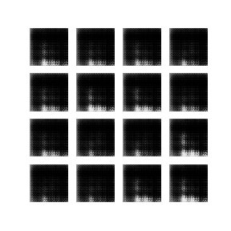
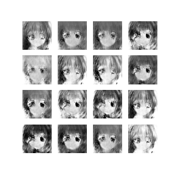
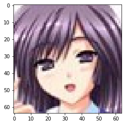
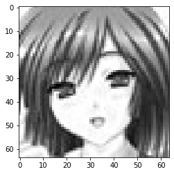
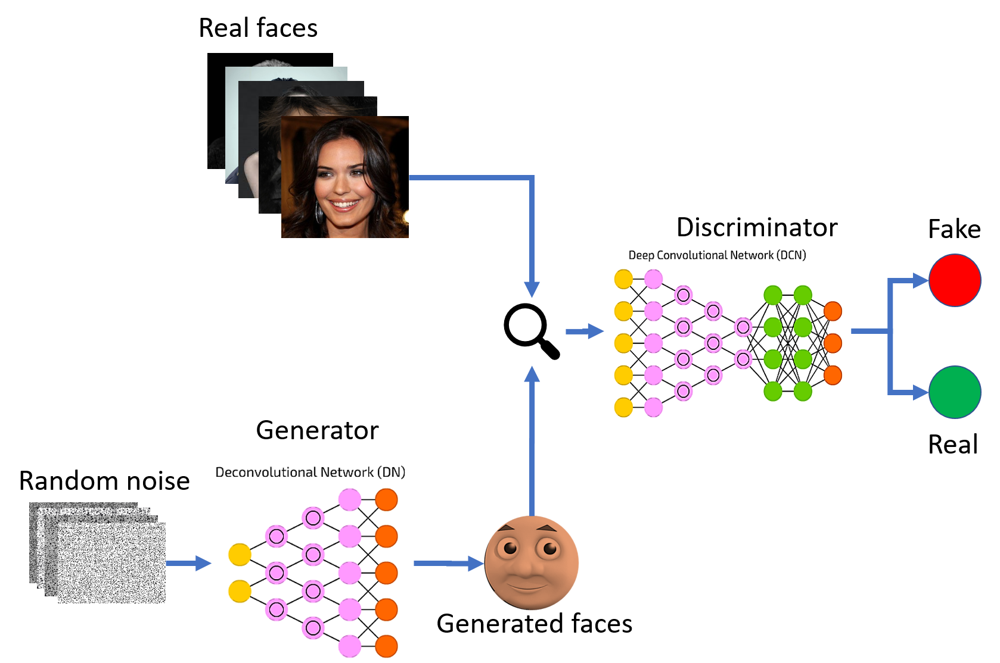

# GAN-Project
# GAN-Project

You heard of gans? GANS. Sounds like guns, cool.

## So I've trained my own Gan. The end.

but wait, there is another.

As you can probably see, I am prepearing my own private 
library for automated GAN training. It may be 
a part of some bigger project, or i will train a 
GAN that generates random memes. Who cares.

#### Deep Convolutional Generative Adversarial Network
or whatever it is called there, is an interesting type
of machine learning model, as it actually consists of two models.
These are professionally called generator and discriminator.
But I prefer to call them 
#### 'Artist' and 'Critique',
as they resamble them mostly.

Artist goal is to create some random art. 
But not completly random, he has a topic. Lets say he's
goal is to paint cute anime girls.

But he is actually colorblind so he only uses gray.

But oh wait, our Artist never actually painted anime girl. 
He actually never painted anything. That is why we have our Critique.
Critique has an access to database of pictures of cute anime girls
[fcking weeboo] and he nows his shit. If he will get some ugly anime painting
he will throw her into the thrash. That is why our Artist will try to create anime girl 
that will be indistinguishable from other Anime girls. Our Critique must be good enough 
to istinguish true anime girl from fake one.

some block diagram for no purpose:

So yeah, that's how it works.
For some mathematitians here: I am currently experimenting with different loss functions
to minimize the mode collapse. As it should be a fully automated process of training I want 
to find such hyperparameters taht 99,99% of time my GAN will be trained create at least
nice approximation of the dataset.

Thats all, bye.
